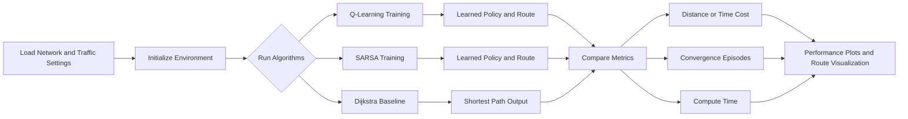

# Intelligent Route Optimizer: Adaptive Traffic Navigation using Reinforcement Learning

> A machine learning-powered system that optimizes traffic routes in congested urban networks using Reinforcement Learning algorithms and SUMO traffic simulation.

## 🎯 Problem Statement

Traffic congestion is a critical challenge in modern cities, particularly in Malaysia where Kuala Lumpur ranks as one of Asia's most congested cities. Current consequences include:
- **Significant time delays** - Extended commute times reduce productivity
- **Increased fuel consumption** - Higher costs and carbon emissions
- **Environmental impact** - Degraded air quality and climate contribution
- **Economic losses** - Billions in wasted time and resources annually

## 📋 Project Overview

This project addresses traffic congestion through **adaptive route optimization** using Temporal-Difference Reinforcement Learning algorithms. Rather than relying on static shortest-path algorithms (like Dijkstra), this system learns optimal routes by adapting to dynamic traffic conditions including congestion levels and traffic light timings.

### Goal & Objectives

**Primary Goal:** Develop and validate RL-based routing agents that find near-optimal routes in congested traffic networks more effectively than traditional algorithms.

**Specific Objectives:**
1. Implement Q-Learning and SARSA temporal-difference learning algorithms for route optimization
2. Compare RL-based routing against baseline Dijkstra algorithm
3. Evaluate convergence speed and solution quality across algorithms
4. Simulate realistic urban traffic networks (Sunway City, 2x3 grid networks)
5. Analyze algorithm performance on both distance and time-based optimization

### Key Technologies

- **Reinforcement Learning:** Q-Learning, SARSA (Temporal-Difference Learning)
- **Traffic Simulation:** SUMO (Simulation of Urban Mobility) with NetworkX
- **Development:** Python, NumPy (Q-table management), Matplotlib (visualization)

## 📊 Project Scope & Constraints

This study operates within the following scope and assumptions:
- **Static network conditions** - No real-time updates for accidents, weather, or disasters
- **Constant vehicle speed** - Fixed at 80 km/hr across all simulations
- **Deterministic congestion** - Pre-configured congestion patterns on specific edges
- **Discrete action space** - Limited routing decisions at each junction (Right, Up, Left, Down)

## 🏗️ System Architecture

**For detailed architecture diagrams, see [diagram.md](diagram.md)** which includes:
- System architecture overview
- Algorithm comparison pipeline
- High-level data flow

### Algorithm Comparison

| Algorithm | Type | Characteristics | Use Case |
|-----------|------|-----------------|----------|
| **Dijkstra** | Graph Search | Deterministic greedy algorithm, finds true shortest path | Baseline comparison |
| **Q-Learning** | Off-Policy RL | Learns optimal policy independently, good convergence | Dynamic environments |
| **SARSA** | On-Policy RL | Learns current policy being followed, more conservative | Real-time adaptation |

### Key Components

```
models/
├── agent.py          # RL Agent base class + Q-Learning & SARSA implementations
├── environment.py    # SUMO traffic network environment wrapper
└── dijkstra.py       # Dijkstra baseline algorithm
```

### Reward Structure

The learning agents use a sophisticated reward system:
- **Completion Reward:** +50 (reaching destination)
- **Bonus Reward:** +50 (finding better route than previous best)
- **Invalid Action Penalty:** -50 (attempting impossible move)
- **Dead-End Penalty:** -50 (reaching node with no outgoing edges)
- **Loop Penalty:** -30 (detecting circular path)
- **Continue Cost:** 0 (normal progression)

## 🔄 Methodology

### Evaluation Criteria

1. **Route Quality Comparison** - RL agents vs Dijkstra baseline (distance/time metrics)
2. **Convergence Analysis** - Episode count and stability of learned policy
3. **Algorithm Efficiency** - Comparison of SARSA vs Q-Learning convergence speed
4. **Computational Performance** - Training time and resource utilization

### Training Configuration

- **Episodes:** 5,000 (configurable)
- **Convergence Threshold:** 5 consecutive successful routes
- **Evaluation Modes:** Distance-based or time-based optimization
- **State Space:** Road network nodes
- **Action Space:** Discrete directions (Right, Up, Left, Down)

## 📁 Project Structure

```
RL-Route-Optimization/
├── main.py                      # Entry point - runs all three algorithms
├── requirements.txt             # Python package dependencies
├── README.md                    # This file
├── models/
│   ├── agent.py                # Q-Learning & SARSA agent classes
│   ├── environment.py          # SUMO traffic network environment
│   └── dijkstra.py             # Dijkstra baseline algorithm
└── network_files/
    ├── 2x3_network.net.xml     # Simple 2x3 grid test network
    └── sunway_network.net.xml  # Real-world Sunway City network
```

## 🚀 Installation & Setup

### Prerequisites

- Python 3.7+
- SUMO (Simulation of Urban Mobility) installed on your system

### Step-by-Step Installation

1. **Install SUMO:**
   - Download from: https://sumo.dlr.de/docs/Downloads.php
   - Follow the official installation guide

2. **Clone Repository:**
   ```bash
   git clone https://github.com/yourusername/intelligent-route-optimizer.git
   cd intelligent-route-optimizer
   ```

3. **Install Python Dependencies:**
   ```bash
   pip install -r requirements.txt
   ```

4. **Configure SUMO Path:**
   Edit `main.py` and set your SUMO installation directory:
   ```python
   def sumo_configuration():
       os.environ["SUMO_HOME"] = "D:/app/SUMO/SUMO/"  # ← Change to your SUMO path
   ```

5. **Select Network & Congestion Profile:**
   Choose your traffic network in `main.py`:
   ```python
   # Option 1: Simple 2x3 grid network
   network_file = './network_files/2x3_network.net.xml'
   
   # Option 2: Real-world Sunway City network
   network_file = './network_files/sunway_network.net.xml'
   ```

6. **Configure Evaluation Method:**
   ```python
   # Evaluate based on distance or time
   env = environment.traffic_env(network_file, congestion, traffic_light, evaluation="d")  # "d" for distance, "t" for time
   ```

## ▶️ Running the Project

### Execute All Algorithms

```bash
python main.py
```

This will sequentially run:
1. **Dijkstra Algorithm** - Baseline shortest-path calculation
2. **Q-Learning** - Train RL agent with off-policy learning
3. **SARSA** - Train RL agent with on-policy learning

### Output Generated

- **Console logs** - Algorithm progression, convergence metrics, computation time
- **Performance plots** - Episode rewards and convergence curves
- **Route visualization** - Graphical display of optimal paths on network map

## 📷 Project In Action



This high-level flow shows how the project runs from network setup to final route and performance comparison across Dijkstra, Q-Learning, and SARSA.

## 🧪 Test Cases & Examples

### Network Configurations

**2x3 Grid Network:**
```
A - B - C
|   |   |
D - E - F
|   |   |
G - H - I
```

**Sunway City Network:**
- Nodes: Universities, commercial centers, and residential areas
- Real-world topology with 100+ intersections
- Realistic traffic patterns from Sunway area

### Congestion Scenarios

The system supports multiple congestion levels:
```python
# Custom congestion configuration
congestion = [
    ("edge_id_1", 10),  # Edge, duration (steps)
    ("edge_id_2", 20)
]

# Or auto-generate
# "low"    - 5% of edges congested
# "medium" - 10% of edges congested
# "high"   - 20% of edges congested
env = environment.traffic_env(network_file, congestion_level="high")
```

### Test Case 1 - Ideal Reward Function
In this test case, we examine the models' ability to converge and the number of episodes taken upon tuning and adjusting the reward function with different reward values.

1. Set the network settings in `main.py` as the following:
```python
# 2x3 Traffic Network
network_file = './network_files/2x3_network.net.xml'
...
start_node = "A"
end_node = "N"

# Sunway City traffic network
network_file = './network_files/sunway_network.net.xml'
...
start_node = "101"
end_node = "105"
```

2. Adjust the Reward Function accordingly in `agent.py`. Note to only edit within the reward parameters:
```python
def step(self, action, state_list, edge_list):
    ...

    # Reward Function with Default Reward Function
    invalid_action_reward = -50
    dead_end_reward = -50
    loop_reward = -50
    completion_reward = 50
    bonus_reward = 50 
    continue_reward = 0
    
    # Reward Function with Reduced loop punishment
    invalid_action_reward = -50
    dead_end_reward = -50
    loop_reward = -30
    completion_reward = 50
    bonus_reward = 50 
    continue_reward = 0

    # Reward Function with Scaled bonus reward
    invalid_action_reward = -50
    dead_end_reward = -50
    loop_reward = -30
    completion_reward = 50
    bonus_reward = ((self.best_result-current_result)/self.best_result)*100 + 50
    continue_reward = 0
```

3. After adjustment, run the code in the terminal. [Follow Method to Run](#method-to-run)
```
> python main.py
```

### Test Case 2 - Traffic Density
In this test case, we stress-test the models' ability to maintain performance as traffic density increases.

**Pre-configured Congestion Scenarios:**  
The [main.py](main.py) file includes commented-out congestion configurations for the Sunway network at different density levels:
- **Low traffic:** ~5% of edges congested
- **Medium traffic:** ~10% of edges congested  
- **High traffic:** ~20% of edges congested

To use these scenarios, uncomment the desired configuration in `main.py` (look for the commented `congestion = [...]` blocks).

**Steps:**
1. Choose a route pair in `main.py` (e.g., Sunway University → Taylors University)
2. Uncomment the desired congestion level from the available presets
3. Adjust reward parameters in [agent.py](models/agent.py) if needed
4. Run: `python main.py`

## Graph Plotting

1. **Route Map**: In `main.py`, the function below maps the routes produced. 
```python
env.visualize_plot(edge_path)
```

2. **Performance Plot**: In `main.py`, the function below creates a line plot on the performance of each episode. This is also the learning curve of the model.
```python
env.plot_performance(number_of_episode, logs)
```

## 📈 Results & Expected Performance

### Benchmark Metrics

When comparing the three algorithms on the 2x3 network:

| Metric | Dijkstra | Q-Learning | SARSA |
|--------|----------|-----------|-------|
| **Execution Time** | Fast (~ms) | Slow (training) | Slow (training) |
| **Convergence** | N/A | ✓ Yes | ✓ Yes |
| **Path Optimality** | Optimal | Near-Optimal | Near-Optimal |
| **Adaptation** | No | Yes | Yes |

### Key Insights

- **Q-Learning** typically converges faster than SARSA but may overshoot optimal paths
- **SARSA** is more conservative, following the actual learned policy during training
- **Convergence speed** improves with smaller state spaces and well-tuned reward functions
- **Traffic density** significantly affects RL performance—higher congestion requires more episodes to converge

## 🔮 Future Enhancements

- [ ] **Real-time Dynamic Updates** - Handle accidents, weather, and road closures
- [ ] **Deep Q-Learning (DQN)** - Scale to larger, more complex networks
- [ ] **Multi-agent Routing** - Optimize routes for multiple vehicles simultaneously
- [ ] **Real-world API Integration** - Connect to live traffic data (Google Maps, Waze)
- [ ] **Policy Optimization** - Use Policy Gradient methods (A3C, PPO)
- [ ] **Visualization Dashboard** - Interactive web interface for monitoring
- [ ] **Distributed Computing** - Parallelize training across multiple GPUs
- [ ] **Transfer Learning** - Pre-train on multiple cities and transfer knowledge

## 📚 References & Resources

### Key Papers
- Sutton, R. S., & Barto, A. G. (2018). *Reinforcement Learning: An Introduction* (2nd ed.)
- Watkins, C. J., & Dayan, P. (1992). "Q-learning". *Machine Learning*, 8(3), 279-292
- Rummery, G. A., & Niranjan, M. (1994). "On-line Q-learning using connectionist systems"

### Tools & Libraries
- **SUMO Documentation**: https://sumo.dlr.de/
- **NetworkX Docs**: https://networkx.org/
- **NumPy Guide**: https://numpy.org/doc/

### Related Work
- Traffic flow optimization using genetic algorithms
- Swarm intelligence approaches to routing
- Machine learning for congestion forecasting

## 🤝 Contributing

We welcome contributions! To contribute:

1. **Fork** the repository
2. **Create** a feature branch (`git checkout -b feature/your-feature`)
3. **Make** your changes with clear commit messages
4. **Test** your changes thoroughly
5. **Submit** a pull request with a detailed description

### Contribution Ideas
- Optimize reward functions
- Implement new RL algorithms
- Add more network topologies
- Improve visualization tools
- Enhance code documentation
- Fix bugs and improve performance

