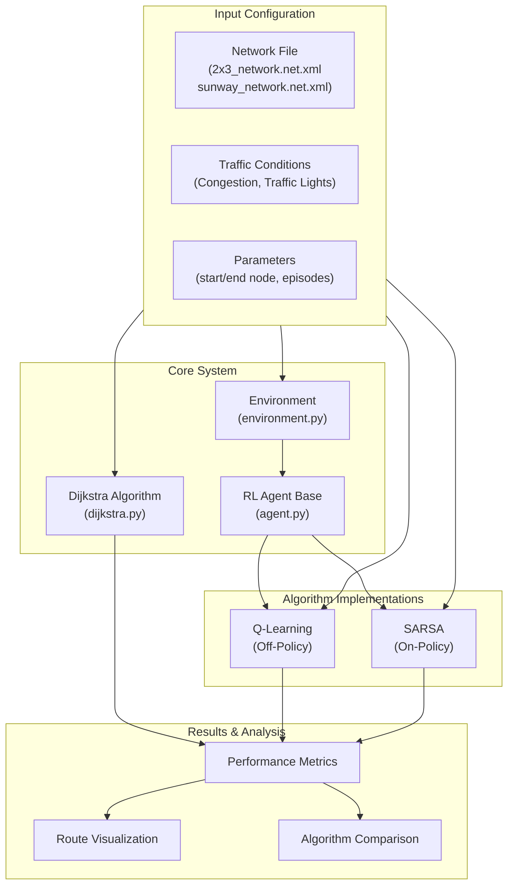
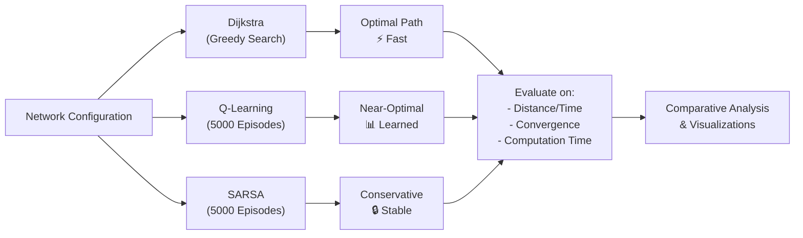
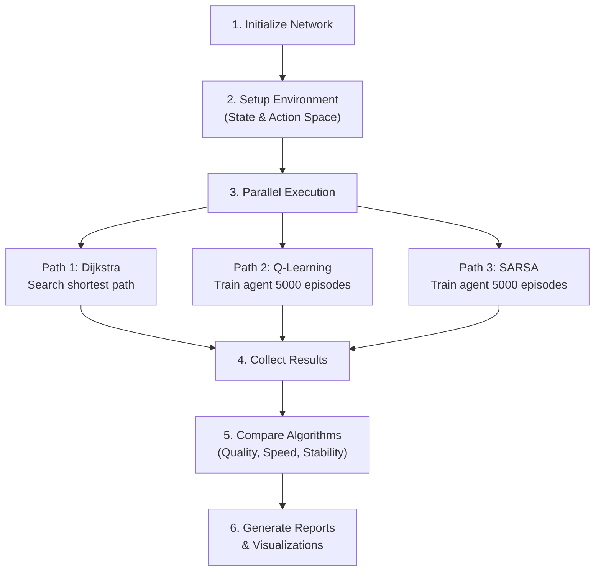

# Project Architecture & Diagrams

## System Architecture Overview

```mermaid
graph TB
    subgraph Input["Input Configuration"]
        Net["Network File<br/>(2x3_network.net.xml<br/>sunway_network.net.xml)"]
        Traffic["Traffic Conditions<br/>(Congestion, Traffic Lights)"]
        Params["Parameters<br/>(start/end node, episodes)"]
    end
    
    subgraph Core["Core System"]
        Env["Environment<br/>(environment.py)"]
        Agent["RL Agent Base<br/>(agent.py)"]
        Dijkstra["Dijkstra Algorithm<br/>(dijkstra.py)"]
    end
    
    subgraph Algorithms["Algorithm Implementations"]
        QL["Q-Learning<br/>(Off-Policy)"]
        SARSA["SARSA<br/>(On-Policy)"]
    end
    
    subgraph Output["Results & Analysis"]
        Metrics["Performance Metrics"]
        Viz["Route Visualization"]
        Compare["Algorithm Comparison"]
    end
    
    Input --> Env
    Input --> Dijkstra
    Input --> QL
    Input --> SARSA
    
    Env --> Agent
    Agent --> QL
    Agent --> SARSA
    
    Dijkstra --> Metrics
    QL --> Metrics
    SARSA --> Metrics
    
    Metrics --> Viz
    Metrics --> Compare
```

---

## Algorithm Comparison Pipeline

```mermaid
graph LR
    Config["Network Configuration"] 
    
    Config --> D["Dijkstra<br/>(Greedy Search)"]
    Config --> Q["Q-Learning<br/>(5000 Episodes)"]
    Config --> S["SARSA<br/>(5000 Episodes)"]
    
    D --> DR["Optimal Path<br/>⚡ Fast"]
    Q --> QR["Near-Optimal<br/>📊 Learned"]
    S --> SR["Conservative<br/>🔒 Stable"]
    
    DR --> Eval["Evaluate on:<br/>- Distance/Time<br/>- Convergence<br/>- Computation Time"]
    QR --> Eval
    SR --> Eval
    
    Eval --> Report["Comparative Analysis<br/>& Visualizations"]
```

---

## High-Level Data Flow

```mermaid
graph TB
    Start["1. Initialize Network"] --> SetEnv["2. Setup Environment<br/>(State & Action Space)"]
    
    SetEnv --> Fork["3. Parallel Execution"]
    
    Fork --> Path1["Path 1: Dijkstra<br/>Search shortest path"]
    Fork --> Path2["Path 2: Q-Learning<br/>Train agent 5000 episodes"]
    Fork --> Path3["Path 3: SARSA<br/>Train agent 5000 episodes"]
    
    Path1 --> Collect["4. Collect Results"]
    Path2 --> Collect
    Path3 --> Collect
    
    Collect --> Compare["5. Compare Algorithms<br/>(Quality, Speed, Stability)"]
    
    Compare --> Output["6. Generate Reports<br/>& Visualizations"]
```

